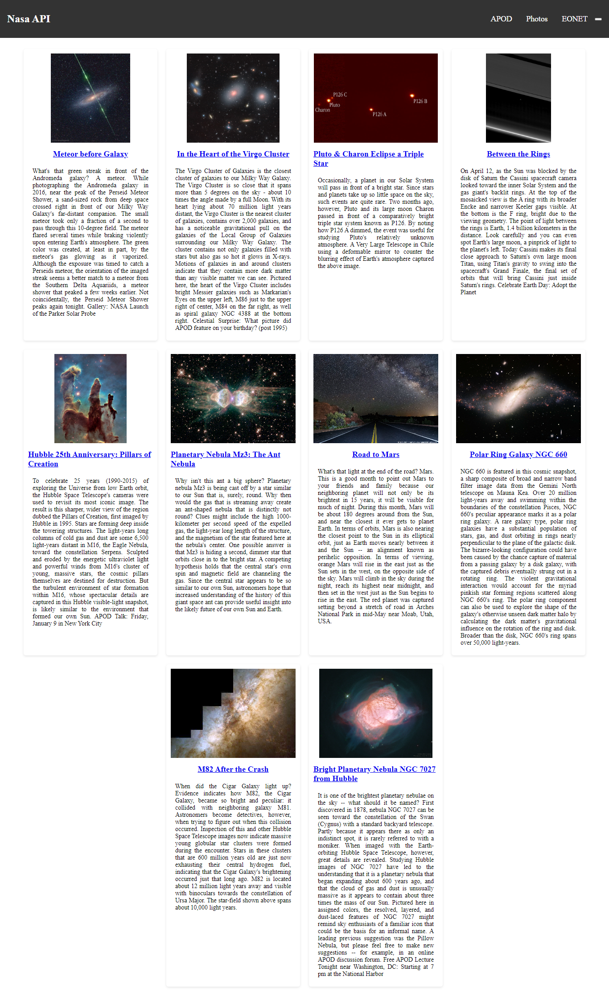

# API de la NASA

Este proyecto es un sitio web que utiliza la API de la NASA para mostrar la imagen astronómica del día, junto con otras imágenes de la galaxia, del sistema solar, de la luna y más.

## Funcionamiento

La página principal muestra la imagen astronómica del día y una lista de las imágenes más recientes en la parte inferior de la página. Al hacer clic en una imagen, se abre una página con información detallada sobre esa imagen, incluyendo la fecha, la explicación, las categorías y la ubicación en el universo.

El sitio web consume la API de la NASA a través de una función `getAstronomyPictureOfTheDay()` que realiza una solicitud HTTP GET y devuelve la información en formato JSON. La información se utiliza para mostrar las imágenes y la información detallada.

## Tecnologías utilizadas

- HTML
- CSS
- JavaScript
- API de la NASA

## Cómo utilizar

Para utilizar este sitio web, simplemente abra el archivo `index.html` en su navegador web. Asegúrese de tener una conexión a Internet para que la página pueda consumir la API de la NASA.

## Mejoras futuras

- Agregar un botón de "cargar más" para mostrar más imágenes en la página principal
- Permitir a los usuarios buscar imágenes por categoría o fecha
- Agregar más información sobre el universo y las imágenes
- Hacer que el sitio web sea responsivo para dispositivos móviles

### Demo

